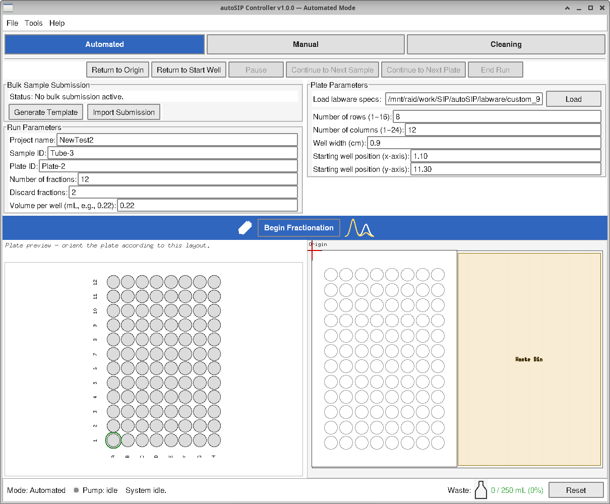
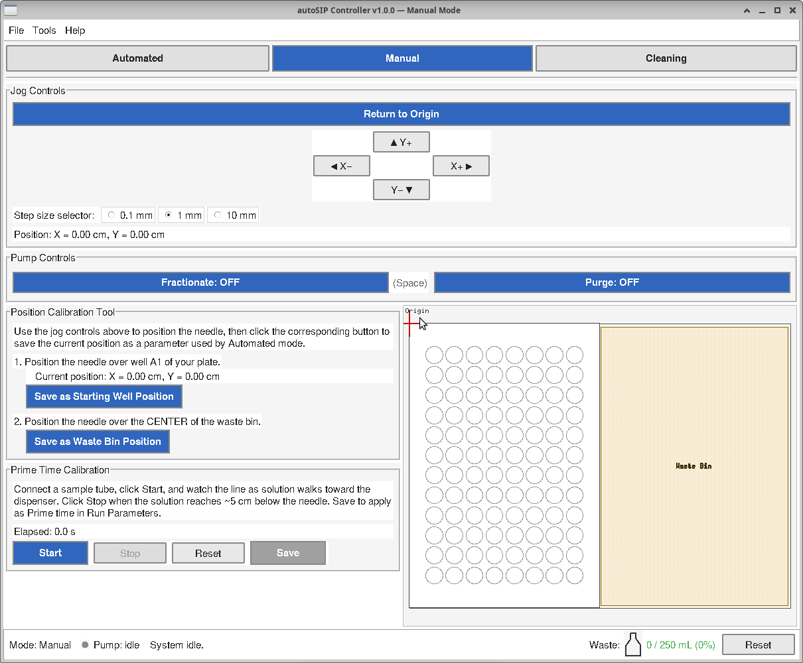
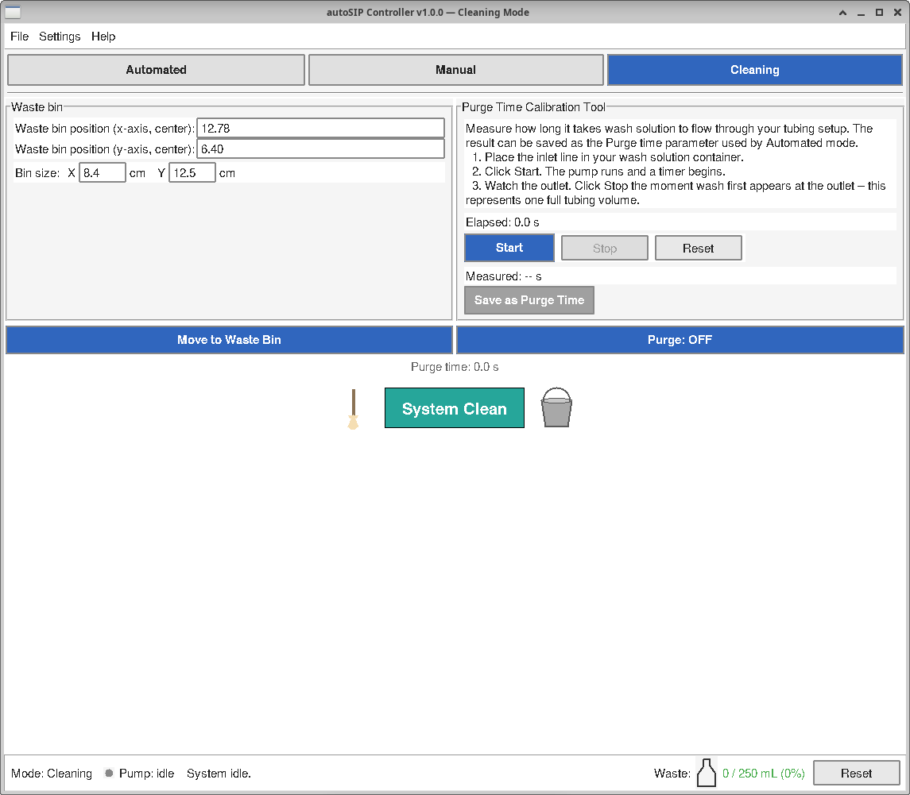

# 6 Operation Instructions

autoSIP (version 1.0.0) is a Python/Tkinter graphical controller for the
Raspberry-Pi-based isopycnic gradient fractionator described in earlier
sections. This section walks through setup, the three operating modes,
five common workflows, the run-logging output, and the safety-stop
mechanism.

## 6.1 General Setup

Clone the repository and install the Python dependencies into a virtual
environment:

```bash
git clone https://github.com/RoliWilhelm/autoSIP-controller.git
cd autoSIP-controller
python -m venv .venv && source .venv/bin/activate
pip install -r requirements.txt
```

Before each session, **park the dispensing carriage at the
upper-left mechanical limit** of the lead screws — gently slide both
axes against their stops by hand while the autoSIP is powered off.
This physical position becomes the software's coordinate origin
`(0, 0)` once the application launches. The origin and the physical
direction of `+X` / `+Y` are fixed regardless of plate orientation;
plate orientation only affects the Starting Well Position the
operator calibrates per session.

The autoSIP supports two pumps connected to a single Digital Loggers
IoT relay on Raspberry Pi GPIO 5:

- The **Razel R-200 fractionation pump** is used for fractionation runs.
- The **Adafruit 3910 peristaltic pump** is used for purging and line
  cleaning.

Only one pump is wired into the relay outlet at a time. The operator
manually swaps the pump connection between fractionation and purging
operations. The software exposes two semantic pump labels —
**Fractionate** and **Purge** — that both drive the same relay; a
confirmation dialog before each activation reminds the operator which
physical pump should be wired in for the chosen operation. While one
semantic claim is active, the other's button is disabled across the UI.

Launch the application:

```bash
python main.py
```

The window opens in **Automated** mode by default. Three mode tabs at
the top of the window (**Automated**, **Manual**, **Cleaning**) highlight
the active mode in the accent color; click any tab to switch directly.
Mode switching is always allowed; the fractionation state machine
keeps ticking in the background while the operator visits Manual or
Cleaning mode. To prevent interference with an active or paused run,
Manual- and Cleaning-mode controls that command motion or pump
activity are *disabled* (with an amber run-active banner explaining
why) until the run finishes or is ended.


## 6.2 Software Interface

autoSIP's window carries three mode tabs at the top — **Automated**,
**Manual**, **Cleaning**. The status bar (bottom of the window)
shows the current pump state and a waste-bin fill indicator labeled
*Waste:* with a flask icon + Reset button. Status messages during
an Automated run appear above the well-plate canvas (next to the
plate they describe); outside a run the status-bar middle area
reads "System idle." Switching modes mid-run is safe — the
fractionation state machine continues to tick in the background
while the operator visits Manual or Cleaning mode, and the plate-
progress canvas re-paints from its current state on return to
Automated.

### 6.2.1 Automated Mode

Automated mode is the main fractionation workflow. The window is laid
out top-to-bottom in four input sections, followed by the Begin
Fractionation button and the well-plate progress display. A row of
five run-control buttons sits at the top-right of the frame.



**Run Parameters.** Identifying information and the per-well volume:

- **Project name** — required identifier (1–64 characters, drawn from
  letters, digits, `.`, `_`, `-`). Becomes the top-level folder under
  `logs/`. Editing the Project mid-run prompts for confirmation: the
  new value applies to subsequent log rows, but files already written
  keep their original Project name.
- **Sample ID** — required identifier with the same character class.
  Identifies the source tube. *Commonly edited mid-run* — update Sample
  ID before clicking Continue to Next Sample after a tube swap.
- **Plate ID** — required identifier. Identifies the physical plate
  currently on the stage. The plate-swap dialog auto-increments the
  trailing integer of this value (e.g., `Plate-1` → `Plate-2`); first-
  launch default is `Plate-1`.
- **Number of fractions** — total fractions to dispense per sample,
  *including discards*. Bounded `[1, 384]`; the application enforces an
  additional `≤ rows × cols` check at run start once labware is loaded.
- **Discard fractions** — number of initial fractions sent to the waste
  bin before plate collection begins. Bounded `[0, N − 1]`. Set to `0`
  to skip the discard phase entirely.
- **Volume per well (mL)** — float in `[0.1, 2.0]`. The pump runs for
  `volume / pump_rate` seconds per well.

**Bulk Sample Submission.** Preload Sample ID, Plate ID, fraction
counts, and volume for an entire multi-sample session from a CSV so
the operator does not have to retype Run Parameters between samples.
Two buttons:

- **Generate Template** — writes a starter CSV with header comments
  and example rows. Only `sample_id` is required per row; blank
  optional cells inherit the current Run Parameters values at the
  moment of import.
- **Import Submission** — parses + validates the CSV; on success,
  Run Parameters auto-populate from row 1 and lock (except Project
  name). A third button — **Exit Bulk Mode** — appears once a
  submission is loaded; clears the loaded samples after confirmation.

Full workflow: §6.3.7.

**Plate Parameters.** Labware geometry and positions:

- **Load labware specs** — at the top of the section. Browse for an
  Opentrons-format JSON file; the application reads `ordering`,
  `dimensions`, and per-well coordinates, then populates the rows,
  columns, well-width, and starting-point fields below.
- **Number of rows** — 1–16.
- **Number of columns** — 1–24.
- **Well width (cm)** — center-to-center well spacing, `[0.1, 5.0]`.
- **Starting well position (x-axis)** — X position of well A1 in cm,
  `[0.0, 20.0]`.
- **Starting well position (y-axis)** — Y position of well A1 in cm,
  `[0.0, 15.0]`.

The previous *Waste bin position (x-axis)* and *(y-axis)* rows
moved out of Plate Parameters and now live in **Tools → Cleaning
Parameters…** alongside the rest of the waste-bin geometry; see
the Tools menu entries below.

**Tools → Pump Parameters…** Razel R-200 fractionation pump settings,
collected in a modal dialog with Save / Cancel buttons:

- **Pump rate (mL/hr)** — float in `[0.1, 600.0]`. Match the value to
  the fractionation pump's gear-set.
- **Drip wait time (s)** — float in `[0.0, 60.0]`, default `1.0`. The
  dwell time *after* the pump shuts off and *before* the carriage moves
  to the next well, so a dispensed drop has time to detach cleanly.
- **Prime time (s)** — float in `[0.0, 600.0]`, default `60`. Duration
  the system automatically runs the fractionation pump at the start of
  every run to walk sample solution from the source tube up to roughly
  5 cm below the syringe dispenser, before the operator performs the
  manual walk-to-droplet step (§6.3.2a). Set this based on your tubing
  length; Manual mode's *Prime Time Calibration Tool* (§6.2.2)
  measures it empirically.
- **Skip wells (optional)** — comma-separated list of canonical
  well IDs (e.g. `A1, B4, H12`) to leave empty during automated
  fractionation, reserved for the operator to fill manually with
  standards, blanks, or other non-fractionated material after the
  run. The list applies uniformly to every plate in the session.
  At Save the input is uppercased, deduplicated, and bounds-checked
  against the loaded labware's row × column count; invalid or
  out-of-range entries refuse the Save and surface an inline error
  naming the offending IDs. *Number of fractions* counts collected
  fractions only, so a request for 10 fractions with `B4` skipped
  traverses 11 snake positions and collects 10. Each skipped well
  appears in `log.csv` as a `status="well_skipped"` row at the
  point in the snake order where the skip occurred. The plate
  preview paints reserved wells with a sandy fill, dashed border,
  and `—` glyph; the hover tooltip reads *"Skipped (reserved for
  blank/standard)"*. Mid-run edits to this list queue for the next
  inter-sample boundary and surface a *"Skip list updated. Changes
  apply at the next sample."* notice; the current sample finishes
  with the list it started with. If a smaller labware spec is
  loaded that would invalidate previously valid entries, the
  out-of-range entries are dropped automatically and a notice
  names which were removed.

Save persists the values to `config.json`; Cancel reverts the dialog
to the values it opened with. Mid-run pump-rate edits apply to the
*next* dispense — the in-flight dispense uses the rate captured when
it started.

**Tools → Cleaning Parameters…** Adafruit 3910 peristaltic pump
settings and waste-bin geometry, collected in a modal dialog with
two LabelFrame sections (Purge & Pump; Waste Bin Geometry):

- **Purge time (s)** — float in `[1.0, 600.0]`, default `30.0`. The
  per-phase duration of the inter-sample purge (see §6.3.2). Use
  Cleaning mode's *Purge Time Calibration Tool* panel (§6.2.3) to
  measure the right value for your tubing geometry.
- **Peristaltic pump rate (mL/min)** — float in `[1.0, 200.0]`,
  default `100.0`. Used by the waste-bin estimator (see §6.5) to
  convert purge-phase pump-on time into a volume contribution.
- **Max waste bin volume (mL)** — float in `[10.0, 5000.0]`, default
  `250.0`. Capacity of your waste container. autoSIP warns at 80 %
  and halts all pump activity at 100 % to prevent overflow.
- **Waste bin position (x-axis)** — X coordinate of the waste
  container's CENTER in cm, `[0.0, 20.0]`. Required when Discard
  fractions > 0.
- **Waste bin position (y-axis)** — Y coordinate of the waste
  container's CENTER in cm, `[0.0, 15.0]`.
- **Waste bin size (X × Y, cm)** — full width and height of the
  rectangular waste bin. The rectangle spans `± extent/2` around
  the center; Begin Fractionation rejects configurations whose
  edges would extend outside the physical table. Non-zero values
  enable shortest-path routing; default `0` keeps the legacy
  point-target behaviour (every move-to-waste targets the center).

Save persists the values and immediately repaints the table view so
bin geometry edits are visible without a mode switch.

**First-launch hint banner.** On a fresh install where the relocated
pump / cleaning fields have not yet been configured, an italic muted
banner appears at the top of the Automated panel: *"Configure pump
and cleaning parameters in the Tools menu before starting a run."*
The banner dismisses itself once the required fields are populated.
Clicking **Begin Fractionation** with any required pump / cleaning
field still blank surfaces a targeted dialog naming the missing
fields and the Tools entry to open.

The *Skip inter-sample purge* behavioral preference lives under
**Tools → Preferences** (§6.2.4) alongside *Return needle to origin
on exit*.

**Run controls** (top-right of the Automated frame):

- **Return to Origin** — moves both motors to physical `(0, 0)` and
  tares the software counters. Same action as Manual mode's
  Return to Origin button (the two are redundant by design). Also
  works while a run is paused: the first click in a pause captures
  the current motor position so the matching Resume can drive the
  needle back and pop an Origin Calibration dialog. This is the
  mid-run recalibration entry point (see §6.3.6).
- **Return to Start Well** — moves the needle to the plate-start
  (well A1) coordinates from Plate Parameters. Enabled only while
  idle; disabled mid-run since interrupting the snake-path would
  lose the operator's place.
- **Pause** — pauses an in-progress run; pump off, motors hold position.
  The button label flips to **Resume** while paused.
- **Continue to Next Sample** — enabled after the auto-pause at "Total
  reached". Starts a new sample series: an optional discard phase, then
  collection at the next available plate well.
- **Continue to Next Plate** — enabled after the auto-pause at "Plate
  full". Opens the plate-swap dialog.
- **End Run** — finalizes the run with a save/discard confirmation.

**Begin Fractionation** is the primary action button at the center of
the strip, flanked by a centrifuge-tube icon on the left and the
bimodal density-distribution icon on the right. Click to validate
inputs, confirm the run summary, and start the state machine.

**Progress display.** A to-scale rendering of the loaded labware shows
each well's state during the run:

- A gray, unmarked well = not yet visited.
- A numbered, colored well = collected fraction. The number is the
  fraction index within the current sample, **including discards**.
  With Discard fractions = 2, the first plate well of a sample is
  numbered **3**.
- Each sample uses a distinct color from the eight-entry Okabe–Ito
  colorblind-safe palette (orange, sky blue, bluish green, yellow,
  blue, vermillion, reddish purple, black). Runs with more than eight
  samples cycle back to the start of the palette.

Hovering over a filled well surfaces a tooltip with the Sample ID and
the fraction's sequence within that sample. While the run is idle and
all five Plate Parameters validate, the plate canvas shows an empty
preview of the labware with a green accent ring around well A1 so the
operator can use it as a placement guide before clicking Begin
Fractionation.

**Table view.** A second canvas to the right of the plate progress
display shows the entire XY table to scale (170.96 mm wide × 127.76 mm
tall — sized for two SBS microplates side-by-side in portrait). The
table view stays visible at all times in Automated mode and gives the
operator a single, spatially-accurate picture of where the dispenser is
relative to the table layout. Elements:

- **Origin marker** — a small dark "+" cross labelled *Origin* at the
  upper-left corner of the table (motor coordinates `(0, 0)`). It is
  fixed and always visible, regardless of Plate Parameters.
- **Plate footprint** — when all five Plate Parameters validate, a
  white SBS-standard rectangle (127.76 × 85.48 mm, transposed in
  portrait) at the calibrated Starting Well Position. The well grid
  sits centered inside the footprint, so a 12-well Corning, a 96-well,
  and a 384-well plate all render at the same plastic perimeter with
  different grid densities inside.
- **Waste-bin marker** — when the Waste Bin Position fields validate,
  an amber rectangle labelled *Waste* drawn at scale and centered on
  the configured `(waste_bin_table, waste_bin_carriage)` coordinate.
  The rectangle spans `± extent/2` around the center on each axis;
  when both extents are 0 the marker collapses to a small amber dot
  at the center (legacy point-target rendering).
- **Live crosshair** — a small red "+" tracks the dispenser's real
  position. Updated at 10 Hz by polling the motor angles, so the
  crosshair traces the snake across the plate during fractionation,
  jumps to the waste bin during discards and inter-sample purges, and
  returns to the upper-left on Return to Origin. Polling pauses while
  Automated mode is hidden (Manual or Cleaning tab active) and resumes
  on switch-back.

All elements share a single millimetre-to-pixel scale derived from the
physical table dimensions, so distances on the canvas are proportional
to physical distances on the table — a useful visual check that the
operator's Starting Well Position calibration places the plate where
they expect it.

### 6.2.2 Manual Mode

Manual mode supports free needle positioning, independent pump
operation, and calibration of the plate-start and waste-bin
coordinates. It does NOT carry the fractionation-sequence inputs;
those live in Automated mode.



**Jog Controls.** Directional movement:

- Four directional buttons: **▲ Y+**, **◀ X−**, **X+ ▶**, **▼ Y−**.
- **Step** selector — three radio buttons: `0.1 mm`, `1 mm`, `10 mm`
  (default `1 mm`). The step size translates directly into the cm
  units used in Automated mode (a 10 mm jog covers the same physical
  distance as typing `1.0` cm into a Starting well position field).
- **Return to Origin** — sits above the directional pad. Moves
  both motors to origin `(0, 0)` and re-zeros the software's
  tracked angle counters. The Position readout then reads exactly
  `Position: X = 0.00 cm, Y = 0.00 cm`. Stepper motors can lose
  steps over a long session; periodically re-park the carriage
  against the upper-left mechanical limit by hand (origin is the
  upper-left mechanical limit regardless of plate orientation) and
  click Return to Origin to recalibrate. A fresh app launch also reads
  `(0.00, 0.00)` — the seating wiggle that initializes lead-screw
  backlash is tared immediately after.
- **Position readout** — `Position: X = {x:.2f} cm, Y = {y:.2f} cm`,
  updated after every jog and Return-to-Origin action. All coordinate displays
  across the GUI use two decimal places (0.01 cm = 0.1 mm
  precision); user-typed values in the Automated-mode coordinate
  entries are normalized on focus-out (`12.6` → `12.60`).

Soft travel limits are enforced on every jog: the X axis is bounded
`[0, 20]` cm and the Y axis `[-15, 0]` cm. The Manual jog buttons
(X+/X−/Y+/Y−) drive the motors in fixed physical directions
regardless of plate orientation. The origin `(0, 0)` is always the
upper-left mechanical limit of the drive screws. Plate orientation
only affects the Starting Well Position (where on the table the
operator places well A1) and the well-to-XY mapping (how plate
row/column indices map to motor coordinates). Pressing **▼ Y−**
from origin moves the carriage into the plate-side travel range;
pressing **▲ Y+** from origin is refused with a status-bar message.
The Y readout shows a **negative** value as the carriage moves away
from origin.

**Pump Controls.** Two pump buttons:

- **Fractionate** — toggles the relay; the button label reads
  `Fractionate: OFF` or `Fractionate: ON`.
- **Purge** — toggles the relay; reads `Purge: OFF` or `Purge: ON`.

The first time either pump is turned on per Manual-mode visit, a
confirmation dialog reminds the operator to verify which pump is wired
to the relay outlet. Both buttons control the same physical relay; the
button for the non-claimant pump is disabled while the other has the
claim.

**Space-bar shortcut.** Pressing the space bar toggles whichever pump
was used most recently. A small `(Space)` hint label sits next to the
bound button so the active target is visible at a glance. The shortcut
is active **only in Manual mode** and **only when no text-entry widget
has keyboard focus** (so space still types a literal space character
inside name fields). The most-recently-used pump persists across
application restarts in `~/.autosip/config.json`.

**Position Calibration Tool.** A sub-panel that captures the carriage's
current cm position into either *Starting well position* (Automated
mode's Plate Parameters) or *Waste bin position* (Tools → Cleaning
Parameters…, also mirrored in this Manual frame's Waste Bin panel) with
one click. The full step-by-step calibration walkthrough lives in
§6.3.1. The Waste bin row prompts the operator to jog the needle over
the bin's CENTER before saving; the rectangle's full width and height
are entered separately as the X / Y extents in Tools → Cleaning
Parameters or in Cleaning Mode's Waste Bin panel.

**Prime Time Calibration Tool.** A stopwatch tool that measures Prime
time empirically for your tubing geometry:

1. Connect a sample tube to the inlet line and place the needle over
   the waste bin (or wherever the prime fluid should be sent).
2. Click **Start**. The Razel R-200 fractionation pump powers on (after the
   first-of-session confirmation dialog) and an *Elapsed* timer ticks
   every 100 ms.
3. Watch the sample solution walk through the tubing toward the
   dispenser. Click **Stop** the moment it reaches approximately
   5 cm below the syringe needle — this represents one tubing-volume
   from sample tube to the manual-walk-to-droplet starting point.
   The measured value is shown next to *Measured*.
4. Click **Save as Prime Time** to write the measured value to
   Automated mode's *Prime time* parameter. The Save button is enabled
   only when the measured value falls within `[0.0, 600.0]` s.

**Reset** clears the measurement state between attempts. The
calibration measurement is *not* written to `log.csv` — it is a setup
operation, not a fractionation event.

**Table view.** Bottom-right of Manual mode — the same canvas
documented under §6.2.1 (origin marker, plate footprint, waste-bin
rectangle, live crosshair) is rendered here too, sharing state via
the App-level plate and waste-bin StringVars. While the operator
jogs to dial in a calibration coordinate, the crosshair traces the
move in real time against the plate footprint and waste rectangle,
making it visually obvious whether the needle is heading to the
right element before any field is saved.

### 6.2.3 Cleaning Mode

Cleaning mode strips Automated mode down to two inputs and two actions
for flushing the fluid path between sample types.



- **Waste bin position (x-axis, center)** and **Waste bin position
  (y-axis, center)** — the X / Y coordinates of the bin's geometric
  CENTER in motor cm. The same two App-level StringVars back the
  matching fields in Tools → Cleaning Parameters… and in Manual mode's
  Waste Bin panel, so an edit in any of the three places propagates
  instantly to the others and triggers a live repaint of the XY table
  view.
- **Bin size: X [__] cm   Y [__] cm** — compact row below the position
  entries. Full width (X) and height (Y) of the bin rectangle; the
  rectangle spans `± extent/2` around the center on each axis. Bound
  to the same shared StringVars as the matching X-extent / Y-extent
  fields in Tools → Cleaning Parameters. Default `0` keeps the legacy
  point-target behaviour (the needle aims at the saved center on every
  move-to-waste). Non-zero values turn on shortest-path routing — see
  §6.2.5.
- **Inline validation.** Each of the four bin fields runs its
  validator on every keystroke (or programmatic update). Invalid
  values — negative extent, unparseable coordinate, or a rectangle
  whose edges would overhang the physical table — surface an inline
  red error indicator next to whichever entry is currently invalid.
  The same indicator appears in Tools → Cleaning Parameters if it is
  open. File → Save current as profile… refuses to write while the
  bin geometry is invalid.
- **Move to Waste Bin** — jogs the needle to a point inside the bin.
  When both extents are 0 the target is the saved center; otherwise
  the shortest-path helper (§6.2.5) picks the closest entry point
  inside the bin's interior to the current needle XY.
- **Purge** — toggles the relay (same semantics as Manual mode's Purge
  button; same confirmation dialog on first activation).
- **System Clean** — runs an on-demand four-phase decontamination
  routine (bleach fill → soak → water rinse 1 → water rinse 2). More
  stringent than the inter-sample purge: the bleach is held static in
  the line for a configurable soak period before rinsing. The soak
  duration is entered at runtime in the Phase 1 (Bleach Fill) dialog
  — default 5 minutes (range 0-30); each invocation resets the field
  to 5, so the value never carries over between System Clean runs and
  no soak-time parameter is persisted in Tools → Cleaning
  Parameters. Use at
  session start or during a paused automated run; the button is
  disabled only during active (non-paused) dispensing. System Clean
  intentionally stops after the second water rinse — priming with
  sample solution is the job of the pre-fractionation prime workflow
  (§6.3.1) or the inter-sample purge's final phase (§6.3.4).

A typical cleaning cycle: switch to Cleaning mode, click **Move to
Waste Bin**, click **Purge**, run the pump until the fluid path is
clear, then click **Purge** again to stop. For a stringent end-of-
session decontamination, click **System Clean** instead and step
through the four-phase routine.

**Purge Time Calibration Tool** — a sub-panel below the manual
Purge controls measures how long wash takes to fully replace one
tubing volume so the Automated mode *Purge time* parameter (§6.2.1)
reflects your actual hardware:

1. Place the inlet line in your wash solution container.
2. Click **Start**. The pump powers on (after the standard
   confirmation dialog) and an *Elapsed* timer ticks every 100 ms.
3. Watch the outlet. Click **Stop** the moment wash solution first
   appears at the outlet — this represents one full tubing volume.
   The measured value is shown next to *Measured*.
4. Click **Save as Purge Time** to write the measured value to
   Automated mode's Purge time entry. The Save button is enabled
   only when the measured value falls within `[1.0, 600.0]` s.

Use **Reset** to clear the measurement state between attempts. The
calibration measurement is *not* recorded in `log.csv` — it is a
setup operation, not a fractionation event.

### 6.2.4 Preferences

Six persistent behavioral preferences live under **Tools →
Preferences**. The first four are stored at the top level of
`~/.autosip/config.json`; notification settings live in a separate
`~/.autosip/notification_config.json` (so the ntfy topic doesn't leak
through shared profiles). All apply across launches.

- **Return needle to origin when closing the application**
  (default `True`) — when the operator clicks the window's close
  button, the application drives both motors to `(0, 0)` and re-tares
  the position counters before the window goes away. Skipped during
  an active run and while the waste-bin lockdown is active — those
  signal a hardware issue that warrants inspection before any
  further motion.

- **Skip inter-sample purge** (default `False`) — when checked,
  Continue to Next Sample bypasses the three-phase purge workflow
  and goes directly to the new sample's discard + collection.
  Leave unchecked for multi-sample runs to prevent carryover
  between samples; useful for solvent-compatible same-sample-type
  sessions where the purge between tubes is wasted effort.

- **Inter-sample purge protocol** (default *Water only*) — radio
  group selecting the workflow used between samples:

  - *Water only (water → sample)* — three phases: sterile water
    flush, air clear, needle priming.
  - *Decontamination (water → bleach → water → sample)* — five
    phases: sterile water flush, **0.5% v/v sodium hypochlorite
    (bleach) flush** (1:10 dilution of household bleach), sterile
    water rinse, air clear, needle priming (which uses *Prime time*,
    not *Purge time*). Use when carryover between sample types must
    be eliminated (e.g. between deuterated and undeuterated runs, or
    between projects). *Prepare the 0.5% bleach solution fresh on
    the day of use — dilute hypochlorite degrades within 24 hours.*

- **Plate orientation** (default *Portrait* on fresh installs) —
  radio group selecting how the plate sits on the XY table:

  - *Portrait* — plate rows on the X-axis, columns on the Y-axis.
    Recommended for this XY table's sizing.
  - *Landscape* — plate columns on the X-axis, rows on the Y-axis.

  The origin `(0, 0)` is always the upper-left mechanical limit and
  the Manual jog buttons always drive the motors in fixed physical
  directions — orientation does NOT invert any motor or move the
  origin. Switching orientation only changes which plate axis maps
  to which motor axis when the operator calibrates the Starting Well
  Position. The LOGICAL snake order is identical between
  orientations: A1, B1, …, (last row)1, then (last row)2, …, B2, A2,
  then A3, B3, … — column-by-column with row direction alternating.
  *Recalibrate Starting Well and Waste Bin positions* using Manual
  mode's Position Calibration Tool after switching. Existing saved
  coordinates are kept but reference the old well-to-XY mapping
  until re-derived. The Preferences dialog pops an explicit
  confirmation on every orientation switch as a reminder.

- **Motor speed mode** (default *Slow speed*) — controls the per-
  microstep delay applied to motor moves:

  - *Slow speed* — all moves run at the fractionation cadence (100 µs
    per microstep). Prevents droplets being flung from the syringe
    during transit.
  - *Variable speed* — well-to-well fractionation moves stay slow,
    but **transit moves** (to/from the waste bin, return to origin,
    plate swaps, pre-fractionation positioning, Manual jogs and
    home) speed up by the configured factor.

  When *Variable speed* is selected, a **Transit speed factor**
  entry becomes editable (default `2.0`, range `1.0–5.0`): the
  transit microstep delay equals the fractionation delay divided by
  this factor. Increase cautiously; verify positioning accuracy
  after each bump, because too high a factor causes missed steps
  and drift.

- **Notifications** — supplementary push alerts that fire **in
  addition to** the on-screen dialog at every manual-intervention
  point. The on-screen dialog remains the source of truth;
  notifications exist so the operator can step away from the bench
  and be called back. Single channel:

  - *ntfy push notifications* (default off) — POSTs to a
    `https://{server}/{topic}` URL (server defaults to `ntfy.sh`).
    Subscribe to the topic on the [ntfy phone app](https://ntfy.sh)
    to receive pushes. **Choose a unique, hard-to-guess topic
    string — anyone who knows it can read your notifications.** The
    topic is stored in `~/.autosip/notification_config.json`,
    which is `.gitignore`d so the file never lands in version
    control.

  A **Send Test Notification** button fires the push using the live
  entry values and shows an inline result (✓ "Test sent" / ✗
  "Test failed — HTTP 401" / etc.). Network failures are logged and
  swallowed; a failed push never blocks a run.

  Notifications fire at five points: sample auto-pause at "Total
  reached", plate-full auto-pause, the pre-fractionation manual-prime
  step entering its "complete" state, the inter-sample purge's
  prime-step "complete" state, waste-bin 80% / 100% thresholds
  (urgent), and Run complete.

OK saves all six preferences and applies the new values immediately
(no app restart needed); Cancel discards.

### 6.2.5 Move-to-Waste Bin Routing

Every time the application drives the needle to the waste container —
the Automated-mode discard phase, the inter-sample purge phases,
the pre-fractionation prime when `D > 0`, the System Clean phases,
and the Manual / Cleaning **Move to Waste Bin** button — it computes
a target point inside the bin rectangle rather than always aiming
at the saved center. The choice depends on whether the operator
has supplied non-zero Bin size extents.

**Legacy point-target (both extents = 0).** The needle moves to
`(waste_bin_table, waste_bin_carriage)` exactly — the bin's saved
center. This matches the pre-rectangle behaviour and is the safe
default for a small, point-shaped catch container.

**Shortest-path routing (both extents > 0).** The bin is modelled
as the rectangle
`[center_x ± extent_x/2] × [center_y ± extent_y/2]`. The routing
helper shrinks that rectangle by a fixed **5 mm rim margin** on every
side (so the dispenser tip cannot drip on the bin's lip), then
clamps the current needle position to the resulting interior:

- If the current XY is already inside the interior, the target is
  the current XY (no move).
- Otherwise the target is the closest interior point — a standard
  point-to-rectangle clamp on each axis independently.
- If an extent is smaller than `2 × 5 mm = 10 mm`, the interior
  collapses on that axis and the helper falls back to the bin's
  center on that axis (so the needle still targets the middle of
  whatever sliver is left).

The visible payoff is two-fold:

1. **Less motor travel between adjacent waste-bin visits.** When
   the previous discard finished near the bin's east edge and the
   next discard arrives from the same approach, the second move
   stays at the east edge instead of crossing the bin to the saved
   center.
2. **More even wear on the bin.** Successive discards land at
   different interior points instead of stacking on the same drop
   site, so a tall narrow bin fills uniformly rather than spilling
   from a single overflowing center.

The XY-table view (§6.2.1) renders the bin rectangle at its full
extents so the operator can visually confirm where the routing is
allowed to land. `log.csv` records the actual target point used for
every move-to-waste event in its `plate_x` / `plate_y` columns — not
the saved center — so per-event provenance reflects where the fluid
physically went, even when the rectangle is large.

## 6.3 Common Workflows

The following five workflows cover the operations most autoSIP users
will perform. Work through §6.3.1 first if the rig has not yet been
calibrated; every other workflow assumes the plate-start and
waste-bin coordinates are known.

### 6.3.1 Calibrating plate-start and waste-bin coordinates

This procedure produces the two pairs of coordinates — *Starting
point* and *Waste bin* — that autoSIP needs to drive the carriage to
well A1 and to the waste container.


1. **Park the carriage at the upper-left mechanical limit.** With
   the autoSIP powered off, gently slide the carriage by hand until it
   rests against the lead-screw stops on both axes. This physical
   position becomes origin `(0, 0)` once you launch the software,
   regardless of plate orientation.

2. **Power on and launch autoSIP.**

   ```bash
   python main.py
   ```

   The window opens in Automated mode by default. Click the **Manual**
   tab in the header to switch.

3. **Verify the Position readout shows `X = 0.000 cm, Y = 0.000 cm`.**
   If it does not (for example because a previous session left the
   software in some other state), click **Home** in the Jog Controls
   section. Home moves both motors to origin and re-zeros the
   software's tracked angle counters.

4. **Place the labware on the stage** in its intended position.
   Tighten any clamps so the plate cannot shift during a run.

5. **Jog the needle to well A1.** Use the **▲ Y+** / **◀ X−** /
   **X+ ▶** / **▼ Y−** buttons. Start with the **10 mm** step to move
   quickly, then switch to **1 mm** as you get close, and to
   **0.1 mm** for final centering. The Position readout updates after
   every jog.

6. **Record the X and Y values from the Position readout.** As the
   needle moves down and to the right from origin, the X value
   increases (positive) and the Y value decreases (negative, because
   Manual mode's Y axis is in motor-frame and the valid travel range
   from origin is `[-15, 0]` cm). Note the magnitudes — these are
   the absolute distances from origin to well A1.

7. **Enter the absolute (positive) values in Automated mode.** Switch
   to **Automated** and enter the magnitudes from step 6 in Plate
   Parameters → `Starting well position (x-axis)` and `Starting well
   position (y-axis)`. Automated mode's Y validator accepts values in
   `[0.0, 15.0]` cm.

8. **Repeat the jog process for the waste container's CENTER.**
   Return to Manual mode, jog the needle until it sits directly
   above the geometric center of the waste container's opening
   (not a corner), and record the magnitudes. Enter them in
   Tools → Cleaning Parameters… under `Waste bin position (x-axis)`
   and `Waste bin position (y-axis)`. (Cleaning mode and Manual
   mode share these two fields, so editing in any of the three
   places updates the others.) If the bin has measurable extents,
   set `Waste bin size (X × Y, cm)` to the full width and height;
   the rectangle spans `± extent/2` around the saved center on
   each axis, and Begin Fractionation refuses to launch a run
   whose bin edges would overhang the physical table.

9. **Save the calibration.** File → *Save current as profile…* writes
   the field values to `~/.autosip/profiles/{name}.json` so you can
   reload them later without re-jogging. Most-recently-used values
   also persist automatically across launches via
   `~/.autosip/config.json`.

**Drift over a long session.** autoSIP does not automatically detect
lost stepper steps. Periodically re-park the carriage against the
upper-left mechanical limit by hand and click **Home** in Manual
mode to re-zero the counters. The origin is the upper-left
mechanical limit regardless of plate orientation.

### 6.3.2 Fractionating multiple samples on a single plate

When several ultracentrifuge tubes' worth of fractions all fit on one
96-well plate, run them sequentially in a single session. The total
of (collected wells + discards) × number of samples must be ≤ plate
capacity for this workflow; if it exceeds capacity, follow §6.3.3.

For this example: five samples, 18 collected wells per sample with
two discard fractions each, total 100 dispense cycles = 90 collected
+ 10 discarded; fits within 96 plate wells.


1. **Set Run Parameters** for the first sample:

   - **Project name** — e.g., `MyStudy_2026_Q2`. Persists across all
     samples in this run.
   - **Sample ID** — e.g., `Tube-A12`. Update between samples.
   - **Plate ID** — e.g., `Plate-1`.
   - **Number of fractions** — `20` (= 2 discards + 18 plate wells).
   - **Discard fractions** — `2`.
   - **Volume per well** — your per-fraction volume in mL, e.g., `0.22`.

2. **Verify Plate Parameters and Pump parameters** are correct from
   your calibration (§6.3.1) and your pump's gear-set or calibration
   table.

3. **Click Begin Fractionation.** A compact confirmation dialog
   opens. It shows the Sample ID and Plate ID prominently (these
   are the parameters most worth a final glance), prompts the
   operator to verify them, and presents a 4-row waste-bin
   projection table (current volume, estimated added this run,
   projected end-of-run, capacity). A ⚠ row appears if the
   projection exceeds capacity. Other run parameters are visible
   in the main window behind the dialog and are not duplicated.
   Click **Begin Fractionation** to start; **Cancel** returns to
   the input fields without launching.

4. **The pre-fractionation priming workflow opens.** Before any
   fluid is dispensed onto the plate, autoSIP walks the sample
   solution from the source tube up to the needle in two phases
   inside a single modal dialog (titled *Prime Fractionation Line*):

   - **Automatic prime.** The needle first moves to the first-
     dispense target (the waste bin if Discard fractions > 0,
     otherwise the start well A1), then the fractionation pump runs
     automatically for the configured **Prime time** seconds. A
     live countdown shows `Prime time: X / Y s remaining` and the
     pump-on indicator. Begin Run is disabled and the space bar
     is ignored during this phase.
   - **Manual walk-to-droplet.** When the automatic prime
     completes, the dialog body changes to *"Automatic prime
     complete. Press Space to walk the solution further until a
     droplet forms at the needle. Press Space again to stop. Click
     Begin Run when ready."* Press **Space** to start the pump,
     watch the line, and press **Space** again to stop. Each
     press-on → press-off pair logs a `prime_manual_ext` row to
     `log.csv` with its measured duration. Begin Run is
     disabled while the pump is on and re-enabled when it stops;
     you can extend as many times as needed.

   Click **Begin Run** to close the dialog and start the discard
   or collection phase from the current needle position (no
   redundant move — the priming already parked the needle).
   Click **Cancel** to abort the run cleanly and return to idle.

   For **bulk submissions**, this priming runs once before the
   first sample only; later samples in the same bulk session are
   primed by the *inter-sample purge's* final phase (§6.3.2)
   instead, which uses the same Prime-time-driven mechanic.

5. **The discard phase runs first.** The needle moves to the waste bin
   and dispenses the two discard fractions there. The progress
   display header reads `Discard phase: N of 2 fractions dispensed
   to waste`.

5. **Collection begins at well A1.** The first plate well is labeled
   **3** (= 2 discards + 1) in the sample's color from the Okabe–Ito
   palette. The application snakes through the plate column-by-column,
   filling wells until the per-sample target is reached.

7. **autoSIP auto-pauses at "Total reached".** The status bar reads
   `Total of {N} fractions reached. Click End Run or Continue to Next
   Sample.` The run-control buttons update: **Continue to Next
   Sample** and **End Run** become enabled.

8. **Physically swap the source tube** on the ultracentrifuge or
   fraction collector to the next sample.

9. **Update Sample ID** in the Run Parameters section, e.g.
   `Tube-A12` → `Tube-A13`. Do not change Project, Plate ID, or any
   other field — they apply to the whole run.

10. **Click Continue to Next Sample.** If you forgot to change Sample
    ID, the application prompts: *"Sample ID is still 'Tube-A12'. Did
    you mean to update it for the new sample? Continue anyway?"*

11. **The inter-sample purge workflow runs** (unless *Skip inter-sample
    purge* is checked in **Tools → Preferences**, §6.2.4). The needle
    first moves to the waste bin, then the application opens a
    multi-step modal sequence. The phase count depends on the
    *Inter-sample purge protocol* preference: three steps for *Water
    only* (default) or five steps for *Decontamination*.

    Each step leads with a **checklist of the physical actions** the
    operator must perform — the steps that the software cannot do
    autonomously, such as swapping the syringe, attaching tubing, or
    moving the inlet line between containers. Below the checklist is
    a pump-toggle status block — `Pump: OFF`/`Pump: ON`, `This cycle:
    X.X s` (current on-period), `Total pumping: X.X s` (cumulative
    for this phase). For wash / bleach / rinse / clear phases the
    primary action button starts the peristaltic pump for the
    configured **Purge time**; pressing **Space** while the cycle is
    in its "complete" state extends pumping until the operator
    presses Space again (the operator decides when enough fluid has
    flowed). **Continue** is disabled while the pump is currently ON
    and while the checklist is incomplete.

    The button row reads `[Cancel] [Skip Checklist (Expert)]
    [Continue]`. Skip bypasses the checklist gate without ticking
    the boxes and writes an audit row to `log.csv`
    (`status="checklist_skipped"`,
    `well_id="checklist_skipped_purge_phase_{N}_{series}"`).

    **Water only (3 phases):**

    1. **Wash.** Checklist: *Disengaged the syringe from the
       collector tube* / *Discarded the used syringe* / *Attached
       the collector tube to the wash line* / *Disconnected inlet
       line from previous sample tube* / *Placed inlet line in water
       container*. Click **Start Purge** to run the peristaltic pump
       for *Purge time* seconds; extend with Space if more flushing
       is needed.
    2. **Clear.** Checklist: *Disconnected the inlet line from the
       water container* / *Line is in air, nothing dripping*. Click
       **Purge** to push air through the line.
    3. **Prime.** Checklist: *Attached a new syringe to the collector
       tube* / *Connected the next sample tube ({new sample ID}) to
       the fractionation line*. A dynamic informational line below
       the checklist names the destination — *"Priming output will
       be dispensed into the waste bin"* (when discards are
       configured for the next sample) or *"Priming output will be
       dispensed into well {current_well_id} — no discards
       configured, so this is collected sample material. Walk only as
       much as needed to form an even droplet."* (when D = 0). The
       primary button reads **Prime sample**; clicking it runs the
       *fractionation pump* for **Prime time** seconds (NOT *Purge time*),
       then enters the "complete" state where pressing **Space**
       extends pumping in walk-to-droplet style. Click **Continue**
       to apply the next sample's parameters and start its
       fractionation.

    **Decontamination (5 phases):**

    1. **Sterile water flush** (peristaltic) — same syringe-swap and
       water-attachment checklist as the Water-only Wash phase above;
       initial rinse of the previous sample's residues.
    2. **Bleach flush** (peristaltic) — checklist: *Removed inlet
       line from water container* / *Placed inlet line in 0.5% bleach
       solution* / *Connection is secure*. Click **Purge** to run
       through **0.5% v/v sodium hypochlorite (bleach) solution
       (1:10 dilution of household bleach)** to decontaminate.
       *Prepare the 0.5% bleach solution fresh on the day of use —
       dilute hypochlorite degrades within 24 hours.*
    3. **Sterile water rinse** (peristaltic) — flush thoroughly to
       remove residual bleach before the next sample contacts the
       lines.
    4. **Air clear** (peristaltic) — checklist: *Disconnected the
       inlet line from the water container* / *Line is in air,
       nothing dripping*. Click **Purge** to push air through.
    5. **Prime sample** (fractionation pump) — same checklist + dynamic
       destination line + Prime-time mechanic as the Water-only
       Prime phase above.

    Each modal has a **Cancel** button that aborts the workflow and
    returns the run to the auto-paused state (you can click
    *Continue to Next Sample* again to restart from Step 1). Each
    pump cycle writes its own row to `log.csv` with status
    `purge_wash` / `purge_clear` / `purge_bleach` / `purge_prime`
    and `well_id` of the form `purge_{phase}_{series}` for the
    initial cycle, `purge_{phase}_{series}_ext{N}` for each Space-bar
    extension, and `purge_wash_{series}_rinse[_ext{N}]` for the
    decontamination protocol's post-bleach water rinse.
    `summary.md` reports total seconds and cycle counts per phase.

    If *Skip inter-sample purge* is enabled in Preferences, this
    workflow is bypassed entirely — the new sample's discard phase
    starts immediately after the pre-flight dialogs.

12. **The new sample's discard phase runs at the waste bin**, then
    collection resumes at the next available plate well in a
    **different color** (Okabe–Ito index 2 instead of 1).

13. Repeat steps 7–12 for each additional sample.

14. **When the last sample finishes, click End Run.** A three-button
    confirmation appears (*"Save the logs for project '…' / sample
    '…'?"*): **Save and End** writes `end_*.json`, `summary_*.md`,
    and `summary_Plate-1_*.md` to the run directory; **Don't Save**
    leaves only the raw `system.start.state.json` + `log.csv` on disk; **Cancel**
    returns to the run without changing state. Enter activates
    Save and End by default; Escape activates Cancel.

After End Run, the progress canvas clears, all run counters reset to
zero, and the run-control buttons return to their idle state. Click
Begin Fractionation again to start a fresh run with new inputs — no
application restart is required.

### 6.3.3 Running a sample whose fractions span multiple plates

When the total work exceeds a single plate's capacity, autoSIP
automatically pauses at the last well of the current plate and
prompts for a plate swap. The same sample's fractions continue on
the new plate in the same color, with the fraction counter
continuing from where it left off.

For this example: eight samples, 18 collected wells each with two
discards — 144 total collected wells, requiring two 96-well plates.


1. Set Run Parameters and click Begin Fractionation as in §6.3.2.

2. **Samples 1–5 complete on Plate-1** (5 samples × 18 wells = 90
   wells filled; 6 wells remain on the plate). After each sample's
   auto-pause, update Sample ID and click **Continue to Next
   Sample**.

3. **Click Continue to Next Sample for sample 6.** Because only 6
   plate wells remain but the new sample needs 18, the application
   shows an informational notice: *"This sample requires 18 wells.
   Only 6 remain on plate Plate-1. autoSIP will prompt for a plate
   swap when the current plate fills."* Click OK to acknowledge.
   The discard phase runs, then collection begins at the next
   available well of Plate-1.

4. **autoSIP auto-pauses at "Plate full"** when sample 6's 6th
   collected well lands at the last well of Plate-1. The
   **Continue to Next Plate** button enables; **Continue to Next
   Sample** stays disabled (sample 6 is not complete).

5. **Click Continue to Next Plate.** A clickable checklist dialog
   opens with four items:

   1. *Removed previous plate (`Plate-1`) and stored it*.
   2. *Moved needle to home* — ticking this checkbox drives the
      carriage to `(0, 0)` directly (no separate Move button).
   3. *Placed new plate on stage*.
   4. *New plate ID:* `Plate-2` (auto-incremented suggestion; the
      checkbox is auto-ticked once the Entry holds a value that
      passes validation, so a fresh dialog already counts this row
      as checked).

   The **Continue** button stays disabled until every checkbox is
   ticked. Two helpers sit beneath the list: **Select All** ticks
   every box at once (and triggers the home move via the home
   checkbox's trace), and **Skip Checklist (Expert)** enables
   Continue without forcing the operator to tick each box —
   intended for users who have done the procedure enough times
   that the checklist is redundant. Skipping writes a
   `checklist_skipped_plate_swap_{N}` row to `log.csv` so the
   bypass is recorded.

   The dialog cannot be dismissed via the window's close box —
   you must either click **Continue** or **Cancel Run**.

6. **After Continue, autoSIP moves to well A1 of Plate-2** and
   resumes sample 6's collection. The fraction counter continues
   from where it left off: if sample 6 was at fraction 8 on Plate-1's
   last well, sample 6 starts at fraction 9 on A1 of Plate-2 in the
   same color.

7. Sample 6's remaining wells finish on Plate-2; samples 7 and 8
   collect on Plate-2 via Continue to Next Sample as in §6.3.2.

8. **Click End Run when the last sample finishes.** Confirm "Yes,
   save."

The output directory contains:

```
end_{end_timestamp}.json
summary_{end_timestamp}.md
summary_Plate-1_{end_timestamp}.md
summary_Plate-2_{end_timestamp}.md
```

The per-plate summary files are filtered slices of the full run
summary — print them out and attach each one to its physical plate
as the plates move to downstream processing. The `log.csv` for this
run includes a `plate_swap` breadcrumb row at each swap (with
`well_id` values `plate_swap_1`, `plate_swap_2`, …) and a `resume`
breadcrumb row at each Continue to Next Sample.

### 6.3.4 Pause and end controls — when to use which

autoSIP has six interruption controls. They look similar in the GUI
but differ in when they are available, what they do to the run, and
what files they produce.

| Button                      | Available when                                                                 | Effect                                                                                                          | Resumable?                                                       | What it writes to `log.csv` / disk                                                                |
| --------------------------- | ------------------------------------------------------------------------------ | --------------------------------------------------------------------------------------------------------------- | ---------------------------------------------------------------- | ------------------------------------------------------------------------------------------------- |
| **Pause** / **Resume**      | During a run (pump, wait, or move phase)                                       | Cancels the in-flight `after()` task; pump relay off; motors hold position. Claim stays held.                   | Yes — click the same button (label becomes **Resume**)           | One `resume` breadcrumb row on Resume, if currently in the collection phase                       |
| **Return to Origin** (mid-pause) | While the run is paused                                                   | Moves motors to `(0, 0)` and tares the counters; captures the paused position on the first click. Used for mid-run recalibration against stepper drift (§6.3.6). | Yes — on Resume, the application moves the needle back to the captured position and shows an Origin Calibration dialog. | No row in `log.csv`. |
| **Continue to Next Sample** | After auto-pause at "Total reached"                                            | Starts a new series: increments series_index, runs the discard phase, then collects at the next available well. | Continues the run                                                | `resume` breadcrumb row                                                                           |
| **Continue to Next Plate**  | After auto-pause at "Plate full"                                               | Opens the plate-swap dialog. After Continue, moves the carriage to A1 of the new plate and resumes.             | Continues the run after the dialog                               | `plate_swap` breadcrumb row                                                                       |
| **End Run**                 | Any active run state (running, paused, total reached, plate full)              | Three-button prompt (Cancel / Don't Save / Save and End); pump off; motors released; visuals reset; FractionatorState counters zeroed. | Cancel stays in the run; Save and End / Don't Save terminate it. | On **Save and End**: `end_{ts}.json`, `summary_{ts}.md`, `summary_{plate_id}_{ts}.md`. On **Don't Save**: none.  |

When to use each:

- **Quick interruption** (operator break, momentary distraction):
  **Pause**. Cleanest interrupt. Click again to resume; the cycle
  picks up at exactly the same point.
- **Stepper drift suspected mid-run**: **Pause** → **Return to
  Origin** → manually re-park the carriage → **Resume** →
  **Origin Calibration**. See §6.3.6 for the full walkthrough.
- **End-of-tube — swap source tubes**: **Continue to Next Sample**.
  autoSIP fires this auto-pause on its own when the per-sample
  fraction target is reached; update Sample ID and click Continue.
- **End-of-plate** (autoSIP triggers this automatically):
  **Continue to Next Plate**, then follow the four-item swap
  checklist.
- **Intentional finish** at the end of a session: **End Run**, then
  **Save and End** to keep the end/summary files (or **Don't Save**
  if the run was a test).
- **Safety emergency** (smell, collision, fluid leak):
  **End Run** → **Don't Save** (or **Save and End** if the partial
  run logs are worth keeping) is the manual halt path. The
  application's automatic waste-bin lockdown (§6.5.1) covers the
  one autonomous emergency case.

Pause is reversible and silent; Continue advances the run; End Run
finishes cleanly and writes the appropriate finalization files for
either choice (Save and End writes end/summary; Don't Save leaves
only the raw `system.start.state.json` + `log.csv`).

### 6.3.5 Cleaning between sample types

Use Cleaning mode to flush the fluid path between sample types — for
example, after running an undeuterated control and before running a
deuterated one, to clear residual buffer or DNA from the tubing.

1. **Disconnect the Razel R-200 fractionation pump from the relay outlet
   and connect the Adafruit 3910 peristaltic pump.** Only one pump
   is wired to the relay at a time; the operator does the swap
   manually.

2. **Switch the autoSIP GUI to the Cleaning tab.**

3. **Confirm the waste-bin coordinates** in the Cleaning panel. The
   X / Y center and the X / Y extents are the same App-level state
   that Tools → Cleaning Parameters… and Manual mode's Waste Bin
   panel edit — set them once via §6.3.1 and they persist across all
   three surfaces.

4. **Click Move to Waste Bin.** The needle moves to the waste-bin
   coordinates.

5. **Click Purge.** A confirmation dialog reminds you that the
   peristaltic pump should be plugged in. Confirm to power on the
   relay.

6. **Wait for the line to clear.** Watch the tubing through any
   transparent sections until clean cleaning fluid is flowing.

7. **Click Purge again to stop.**

8. **Disconnect the peristaltic pump and reconnect the fractionation pump
   before starting the next Automated run.** The software cannot
   detect which pump is wired in — that is the purpose of the
   Fractionate/Purge confirmation dialogs.

**System Clean (deep decontamination).** For a more stringent
session-start or session-end decontamination — e.g. before switching
between isotope-labelling experiments — use the **System Clean**
button at the bottom of Cleaning mode instead of the manual Purge
above. The routine is a four-phase modal sequence:

1. **Bleach fill** (peristaltic) — checklist: *Connected inlet line
   to 0.5% bleach solution* / *Outlet routed to waste bin*. The
   **Bleach soak time** is entered in this dialog (default `5` min,
   range `0–30`; the value is reset to 5 on every System Clean
   invocation and is *not* a persisted Cleaning Parameter). Click
   **Start Bleach Fill** to run the peristaltic pump for *Purge time*
   seconds, drawing 0.5% bleach through the line.
2. **Bleach soak** — pump OFF. A `mm:ss / mm:ss remaining` countdown
   for the duration entered in Phase 1. A **Skip soak** button
   advances early; the `sysclean_soak` log row records the *actual*
   elapsed soak seconds.
3. **Water rinse 1** (peristaltic) — checklist: *Replaced bleach
   source with sterile water*. Click **Start Rinse** to flush bleach
   out for *Purge time* seconds.
4. **Water rinse 2** (peristaltic) — checklist: *Water source is
   still connected*. Click **Rinse Again** to repeat the rinse.
   **Continue** at the end of this phase closes the routine.

System Clean is runnable from idle **and** while an automated run is
operator-paused (the routine borrows the peristaltic claim during
the cleaning and restores the run's `fractionate` claim on finish,
so the paused run remains resumable from the Automated tab when the
clean is done). The button is disabled only while a run is actively
dispensing (non-paused). System Clean intentionally stops after the
second water rinse — priming with sample solution is the
pre-fractionation prime workflow's job (§6.3.2, step 4) or the
inter-sample purge's final phase (§6.3.2, step 11).

Each pump cycle writes a `sysclean_bleach`, `sysclean_soak`,
`sysclean_rinse1`, or `sysclean_rinse2` row to `log.csv`. When System
Clean is launched from idle, the rows land in a dedicated log dir at
`logs/system_clean/{timestamp}/log.csv`; when launched from a paused
run, they append to that run's existing `log.csv` instead.

### 6.3.6 Recalibrating mid-run after stepper drift

Stepper motors occasionally miss steps, so the software's tracked
position can drift away from the true physical position over a long
run. autoSIP supports a mid-run recalibration that re-zeros the
counters against the upper-left mechanical limit (which is always
the origin, regardless of plate orientation) without aborting the
run.

1. **Notice the drift.** The dispensed drop lands slightly off-well,
   or the snake path looks visibly shifted. Click **Pause**.

2. **Click Return to Origin.** The motors drive to coordinate `(0, 0)`
   and the software's tracked counters are tared. The current motor
   position at the moment of the click is captured so the matching
   Resume can drive the needle back to it. Status bar:
   *"Returned to origin. Origin Calibration dialog open."*

3. **Manually re-park the carriage** against the upper-left
   mechanical-limit stops. The software's `(0, 0)` now matches the
   physical upper-left mechanical limit — drift is corrected.

4. **Click Resume in the Origin Calibration dialog.** The
   application drives the needle from the freshly-calibrated origin
   to the position captured in step 2, then the state machine
   continues from where it was paused (mid-pump, mid-wait, or
   between wells).

If the dialog's re-park check looks wrong, click **Cancel**
instead. The run stays paused; the needle stays at `(0, 0)`. You
can click Return to Origin again to retry, or End Run to abandon.

Multiple Return-to-Origin clicks during the same pause are safe —
only the FIRST click captures the reference position. Subsequent
clicks simply re-issue the move-to-origin + tare, so an operator
who botches the first manual re-park can retry without losing the
"where the run actually was" reference.

The recalibration flag clears on Resume-confirm, End Run, Continue
to Next Sample, and Continue to Next Plate — those all advance the
run past the paused point, so the captured position is no longer
the right reference.

### 6.3.7 Running a bulk submission

For multi-sample sessions, autoSIP can preload Sample ID, Plate ID,
fraction counts, and per-well volume for every tube from a spreadsheet
so the operator does not have to retype Run Parameters between
samples. This is the recommended workflow whenever more than two
tubes are being processed in a session.

1. **Generate a template.** In Automated mode, open the *Bulk Sample
   Submission* panel above Run Parameters and click **Generate
   Template**. Pick a save location (e.g. on a USB stick or in your
   project folder). The CSV opens with header comments explaining
   the columns and two example rows.

2. **Fill in the spreadsheet.** Edit the CSV in a spreadsheet editor
   (LibreOffice Calc, Excel, Google Sheets). The only required
   column is `sample_id`; blank cells in the optional columns
   (`plate_id`, `number_of_fractions`, `discard_fractions`,
   `volume_per_well_ml`, `notes`) inherit the value currently in the
   GUI's Run Parameters at the moment of import. Comment lines
   starting with `#` and blank lines are ignored. Delete the example
   rows before importing.

   **Plan plate capacity.** A 96-well plate holds 96 fractions
   minus any pre-collected wells. If your samples in aggregate
   would exceed the capacity of one plate, choose where the plate
   swap occurs by setting `plate_id` to a new value (e.g.
   `Plate-2`) on the first row that should land on the new plate.
   The transition dialog at that point will prompt you to swap the
   physical plate before continuing.

3. **Import the submission.** Click **Import Submission** in the
   Bulk Sample Submission panel and pick the CSV. autoSIP validates
   every row before activating the panel — if any row fails (bad
   Sample ID character, non-integer fraction count, discards ≥ N,
   out-of-range volume) the import is rejected as a whole and the
   panel stays inactive. Fix the spreadsheet and re-import.

   On success, Run Parameters auto-populate from row 1 and lock.
   The panel header shows the source filename and a status line
   (e.g. *"Bulk mode — 8 samples loaded, sample 1 of 8"*). The
   **Project name** field remains editable so you can adjust the
   log folder before clicking Begin Fractionation.

4. **Begin Fractionation.** Confirm the run summary — the dialog
   includes a "Bulk mode" line showing total samples and the
   sample-1 ID. The first sample runs exactly like a normal
   single-sample run.

5. **Transition dialog at each Total reached.** When the first
   sample finishes (auto-pause at "Total reached"), a *Continue to
   Next Sample* dialog opens automatically. It shows the next
   sample's Sample ID, Plate ID, and the inter-sample purge
   reminder. You can edit the Sample ID inline if the physical tube
   label differs from the spreadsheet — edits are flagged in the
   final `summary.md` with a `b` suffix on the Sample ID. Click
   **Continue** to apply the next sample's metadata to Run
   Parameters and start the discard phase for that sample.

   If you instead click **End Run** in the transition dialog,
   bulk mode exits and the run finalizes with whatever samples
   were completed.

6. **Final sample.** After the last sample's Total reached, the
   transition dialog reads *"Bulk Run Complete"* and offers only
   End Run. Click it to write the final summary and exit bulk mode.

The `summary.md` for a bulk run includes a `## Bulk submission`
section listing the source spreadsheet path, total samples, and the
as-run Sample ID sequence (with `b` markers for any IDs edited in
the transition dialog). The `system.start.state.json` at run start records
the full spreadsheet contents so the planned vs. actual sequence is
recoverable later.

## 6.4 Logging Output

Each run writes a directory under `logs/` in the working directory:

```
logs/
└── {project}/
    └── {timestamp_start}_{sample_id_at_start}/
        ├── system.start.state.json
        ├── log.csv
        ├── end_{end_timestamp}.json
        ├── summary_{end_timestamp}.md
        └── summary_{plate_id}_{end_timestamp}.md
```

The `{timestamp_start}` and `{end_timestamp}` are ISO 8601 datetimes
with colons replaced by hyphens (e.g., `2026-05-19T14-22-01`) so the
filenames are portable across operating systems and multiple End Runs
in the same session never overwrite each other.

**system.start.state.json** — captured at run start. Contains the project name,
Sample ID at start, Plate ID at start, the parameters block (rows,
cols, well width, pump rate, drip wait time, volume per well,
waste-bin coordinates, plate-start coordinates, number of fractions,
discard fractions), the labware file path, the inline labware JSON
contents, and the estimated total run time.

**log.csv** — one row per fraction, plus breadcrumb rows at sample
and plate boundaries. Columns:

```
project, sample_id, plate_id,
well_id, plate_x, plate_y,
dispense_start_iso, dispense_end_iso,
dispense_duration_s, status
```

Status values:

- `completed` — plate well dispense finished cleanly.
- `discarded` — discard cycle finished cleanly.
- `resume` — breadcrumb at the start of a new series (Continue to
  Next Sample) or after Pause + Resume during the collection phase.
- `plate_swap` — breadcrumb at the start of a new plate (Continue to
  Next Plate); the `well_id` for these rows is `plate_swap_1`,
  `plate_swap_2`, etc.
- `purge_wash` / `purge_clear` — inter-sample purge pump phases.
  `well_id` is `purge_{phase}_{series}` for the initial cycle and
  `purge_{phase}_{series}_ext{N}` for each Space-bar extension; the
  `dispense_duration_s` column carries the measured per-cycle pump
  duration.
- `checklist_skipped` — emitted when the operator clicks **Skip
  Checklist (Expert)** on a plate-swap or inter-sample-purge dialog.
  `well_id` is `checklist_skipped_plate_swap_{N}` or
  `checklist_skipped_purge_phase_{N}_{series}` so the bypass is
  pinpointed in the log.
- `well_skipped` — emitted when the snake-routing path arrives at
  a well in the operator's reserved list (Settings →
  Fractionation Parameters → Skip wells). The `well_id` carries
  the skipped well's canonical ID (e.g. `B4`); `plate_x` /
  `plate_y` / `dispense_*` columns are left blank because no
  dispense happened. One row is written per skipped well, in the
  snake order where the skip occurred, so a reader can verify
  the controller respected the list.
- `waste_autopause` / `waste_hardstop` / `waste_reset` — breadcrumb
  rows for waste-bin events (80% advisory auto-pause, 100% hard
  stop, operator Reset). The legacy aliases `waste_warning` and
  `waste_shutoff` (mapped to autopause / hardstop respectively) may
  appear in older log files.
- `prime_auto` — the pre-fractionation automatic prime cycle
  (fires once at the start of every run, see §6.3.2 step 4).
- `prime_manual_ext` — one Space-toggle extension cycle of the
  pre-fractionation manual prime; `well_id` is
  `prime_manual_ext{N}` (1-based).
- `sysclean_bleach` / `sysclean_soak` / `sysclean_rinse1` /
  `sysclean_rinse2` — System Clean phases (§6.3.5). Extension
  cycles append `_ext{N}` to the `well_id`. See `docs/logging_reference.md`
  for the complete log.csv field-by-field reference.
- `emergency_stopped` — the run was terminated while this well or
  discard cycle was mid-dispense. Also used for purge pump cycles
  interrupted by Escape or window close.

**end_{end_timestamp}.json** — written only if you choose **Save and
End** at End Run. Contains the final status (`completed`,
`manual_abort`, or `emergency_stopped`), wells completed, wells
planned, actual total time, and the list of plates used.

**summary_{end_timestamp}.md** — human-readable run summary.

**summary_{plate_id}_{end_timestamp}.md** — one file per plate the
run touched. Filtered slice of the run summary, suitable for printing
and attaching to the physical plate as it goes to downstream
processing.

`system.start.state.json` and `log.csv` are written **continuously during the
run**; the three `_{end_timestamp}` files are written **only when End
Run is confirmed with Save and End**. If you choose **Don't Save**,
the system.start.state.json and log.csv remain on disk but no end/summary files
are produced — useful when the run was a test or calibration you do
not want to archive.

## 6.5 Safety Controls

Operator-initiated halts go through **Pause** (reversible, the cycle
resumes from the same phase) or **End Run → Don't Save** (one-way,
no finalization files). Both pump activity and motor motion stop
immediately on either. There is no dedicated emergency-stop button
or keyboard shortcut — the only keyboard shortcut in the
application is **Space**, which toggles the most-recently-used pump
in Manual mode.

The one autonomous emergency path is the waste-bin overflow
lockdown described in §6.5.1: the application halts pump activity
on its own when the running waste-volume estimate reaches the
configured maximum, and a `waste_hardstop` row is appended to
`log.csv`. The operator clears the lockdown via the **Reset**
button next to the flask icon in the status bar.

### 6.5.1 Waste-bin overflow protection

autoSIP maintains a **live, real-time** internal estimate of how
full the waste container is and locks down pump activity before it
overflows. The right side of the status bar shows an Erlenmeyer
flask icon, a numeric readout (`{volume} / {max} mL ({pct}%)`),
and a **Reset** button. The flask fills from the bottom up and
changes colour with the fill level (green → amber → orange → red)
**continuously while any pump is on** — a 500 ms tick re-evaluates
the running estimate, so the operator sees the bar level change
during a purge, not only at the end of one.

The estimate is computed by multiplying every recorded pump-on
duration by the matching pump rate:

- Each Automated-mode discard cycle adds `volume_per_well` mL
  (configured Volume per well — by construction one full per-well
  dispense lands in the waste bin during the discard phase).
- Each inter-sample purge phase (wash and clear) adds
  `phase_duration_s × peristaltic_rate_ml_per_min / 60` mL.
- Manual-mode Purge button on→off, Cleaning-mode Purge button
  on→off, and Purge Time Calibration Start→Stop each add the same
  peristaltic-rate-based contribution. Manual-mode *Fractionate* is
  **not** tracked (its dispense location is ambiguous).

Because the estimate depends on the configured pump rates matching
the physical hardware, it can drift over time. Treat it as
"approximate" rather than "measured."

**80% advisory auto-pause.** When the running estimate reaches 80%
of the configured *Max waste bin volume*, the pump is auto-paused
(relay off), the run's state machine pauses, and a blocking
threshold modal appears with two buttons: **Reset** (use after a
physical empty; clears the threshold and re-arms the warning for
the next fill cycle) and **Resume** (always enabled — the operator
may decide to push past the 80% point if the bin actually has
headroom). A `waste_autopause` row is appended to `log.csv`. The
warning fires once per fill cycle; it re-arms after a Reset.

**100% auto-shutoff.** When the running estimate reaches the
configured maximum:

- All pump activity halts immediately.
- All run-control buttons are disabled except **End Run**.
- If a Cleaning operation or Purge Time Calibration was running, its
  controls are disabled too.
- If an inter-sample purge phase was mid-pump, its modal stays open
  showing a "HALTED" message; re-click the modal's action button
  after Reset to retry the phase from the start.
- The threshold modal's **Resume** button is **disabled** until the
  operator clicks Reset (physical empty must precede recovery).
- A `waste_hardstop` row is appended to `log.csv`.

**Reset workflow.** After physically emptying the waste container,
click **Reset** in the status bar. The application asks for
confirmation, then:

- Resets `waste_volume_ml` to 0 and re-arms the 80 % warning.
- Appends a `waste_reset` row to `log.csv` (if a run is active).
- Clears the auto-shutoff lockdown if one was active, re-enabling
  the run-control buttons.

Reset should follow a physical empty, not precede one — the
application has no way to verify the container is actually empty.

The counter resets to 0 on every app launch as well: if you empty
the bin between sessions and start a fresh process, the counter
reflects the empty state automatically. If you empty mid-session,
use Reset; if you close and reopen the app instead, the new process
starts fresh either way.
